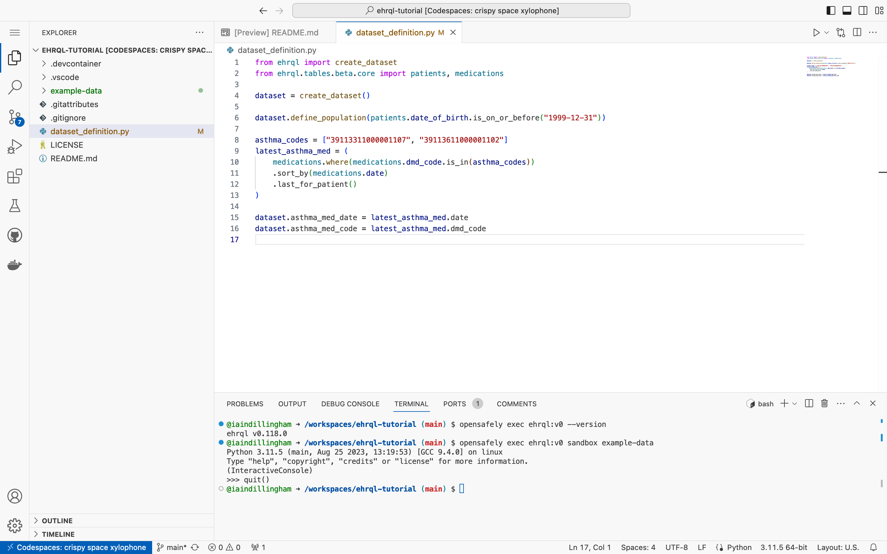

In this section, you will generate a dummy dataset.

## Exit the sandbox

Exit the sandbox and return to the terminal.

```pycon
>>> quit()
```



## Generate a dummy dataset

In the terminal, type

```
opensafely exec ehrql:v0 generate-dataset dataset_definition.py
```

and press ++enter++.

The terminal will fill with a dummy dataset in CSV format.
Scroll up to see the column headers;
notice that two column headers correspond to the two patient series
— `asthma_med_date` and `asthma_med_code` —
that you added to the dataset definition.

Also notice the lines that start with `[info]`.
These show that the dummy data generator generated dummy data for 5,000 patients;
found 500 that matched the dataset definition;
and displayed them in the terminal.


??? tip "The anatomy of an OpenSAFELY command"
    What do the parts of the OpenSAFELY command
    `opensafely exec ehrql:v0 generate-dataset dataset_definition.py`
    do?

    * `opensafely exec` executes an OpenSAFELY action outside [the project pipeline][1]
    * `ehrql` is the OpenSAFELY action to execute
    * `v0` is the major version of the ehrQL action
    * `generate-dataset` is the ehrQL command to generate a dataset from a dataset definition
    * `dataset_definition.py` is the dataset definition

[1]: https://docs.opensafely.org/actions-pipelines/
