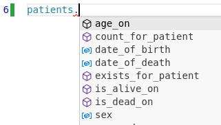

The QOF register for diabetes should contain all patients who, on 31st March 2024:

* were at least 17 years old,
* were alive,
* were registered with a GP practice, and
* had an unresolved diabetes diagnosis.

To start with, we'll show you how we can transform the `patients` table to find the patients who were at least 17 years old and alive on 31st March 2024.

These are very common things to want to know, so ehrQL gives us some helper functions: `patients.age_on` and `patients.is_alive_on`.

Update `dataset_definition.py` so that it contains the following:

```ehrql
from ehrql import show
from ehrql.tables.core import patients, practice_registrations, clinical_events, medications

index_date = "2024-03-31"

show(
    patients.age_on(index_date),
    patients.is_alive_on(index_date)
)
```

??? tip "Autocomplete"

    Notice how you get autocomplete suggestions as you type ehrQL:

    

    This makes it easier to check your ehrQL is valid, and to discover the various columns and functions on each table.

When you run the code now, you will see a table with two columns indicating each patient's age on the index date, and whether they were alive on the index date.

Each of these columns is a patient series.
The first series contains integers, and the second contains booleans.
We will want to convert the first series to booleans, as we are not interested in the exact age of our patients, but whether they are at least 17 years old:

```ehrql
from ehrql import show
from ehrql.tables.core import patients, practice_registrations, clinical_events, medications

index_date = "2024-03-31"

show(
    patients.age_on(index_date) >= 17,
    patients.is_alive_on(index_date)
)
```

We now have two boolean series, and it will be useful to give them names so that we can refer to them later:


```ehrql
from ehrql import show
from ehrql.tables.core import patients, practice_registrations, clinical_events, medications

index_date = "2024-03-31"

aged_17_or_older = patients.age_on(index_date) >= 17
is_alive = patients.is_alive_on(index_date)

show(aged_17_or_older, is_alive)
```

One thing we can do with boolean series is combine them with boolean operators.
Here, we're asking whether each patient was both aged 17 or older and alive on the index date:


```ehrql
from ehrql import show
from ehrql.tables.core import patients, practice_registrations, clinical_events, medications

index_date = "2024-03-31"

aged_17_or_older = patients.age_on(index_date) >= 17
is_alive = patients.is_alive_on(index_date)

show(
    aged_17_or_older,
    is_alive,
    aged_17_or_older & is_alive
)
```

> Question: What happens if you change `&` to `|`?

`patients.age_on` and `patients.is_alive_on` are defined in terms of other ehrQL constructs.
You can see the definitions in [the ehrQL documentation][1].

Here's code that does the same thing, without using helper functions:


```ehrql
from ehrql import show
from ehrql.tables.core import patients, practice_registrations, clinical_events, medications

index_date = "2024-03-31"

aged_17_or_older = (index_date - patients.date_of_birth).years >= 17
is_alive = patients.date_of_death.is_null() | (patients.date_of_death > index_date)

show(
    aged_17_or_older,
    is_alive,
    aged_17_or_older & is_alive
)
```

Notice that we're making use of a number of language features, including [subtracting dates][2] and [extracting a number of years from the resulting value][3], and [asking whether a value is null or not][4].

The full range of language features is documented in the [ehrQL Language Reference][5].

> Question: Can you explain what `show(index_date - patients.date_of_birth)` shows?

> Challenge: Try using `show()` to investigate other fragments of ehrQL in the code above.

Next: [More complex transformations](../more-complex-transformations/index.md)

!!! abstract "Feedback"
    Had enough? That's not a problem, but if you could fill in this very short [feedback form][6]{:target="_blank"} we'd really appreciate it.

[1]: ../../reference/schemas/core.md#patients.age_on
[2]: ../../reference/language.md#DatePatientSeries.sub
[3]: ../../reference/language.md#DateDifference.years
[4]: ../../reference/language.md#BoolPatientSeries.is_null
[5]: ../../reference/language.md
[6]: https://docs.google.com/forms/d/e/1FAIpQLSeouuTXPnwShAjBllyln4tl2Q52PMG_aUhpma4odpE2MmCngg/viewform
