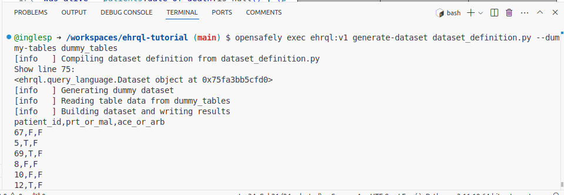

The last piece in the puzzle is to demonstrate how to use a dataset definition in an OpenSAFELY study.
An OpenSAFELY study consists of a set of actions.
At least one action must be an ehrQL action, to extract a dataset from an OpenSAFELY backend.

You can run a single action using [`opensafely exec`][1].

In your Codespace, open a terminal by pressing `Ctrl+J`, and run:

```
opensafely exec ehrql:v1 generate-dataset dataset_definition.py --dummy-tables dummy_tables
```

You should see the terminal fill with a table of data in CSV format.
Scroll up to see the column headers, and notice the two columns from your dataset definition (`prt_or_mal` and `ace_or_arb`).



> Question: what happens if you rename the `dataset` variable and run the `opensafely exec` command again?

??? tip "The anatomy of an OpenSAFELY command"
    What do the parts of the OpenSAFELY command
    `opensafely exec ehrql:v1 generate-dataset dataset_definition.py`
    do?

    * `opensafely exec` executes an OpenSAFELY action independently of other OpenSAFELY actions
    * `ehrql` is the OpenSAFELY action to execute
    * `v1` is the major version of the ehrQL action
    * `generate-dataset` is the ehrQL command to generate a dataset from a dataset definition
    * `dataset_definition.py` is the dataset definition
    * `--dummy-tables dummy_tables` gives the path to the dummy data

Note: [the main OpenSAFELY tutorial][2] documents how you can describe the actions of your study in a file called `project.yaml`.

Next: [Test your ehrQL knowledge with a quiz!](../quiz/index.md)

[1]: https://docs.opensafely.org/opensafely-cli/#exec-interactive-development
[2]: https://docs.opensafely.org/getting-started/tutorial/run-the-project-pipeline/
